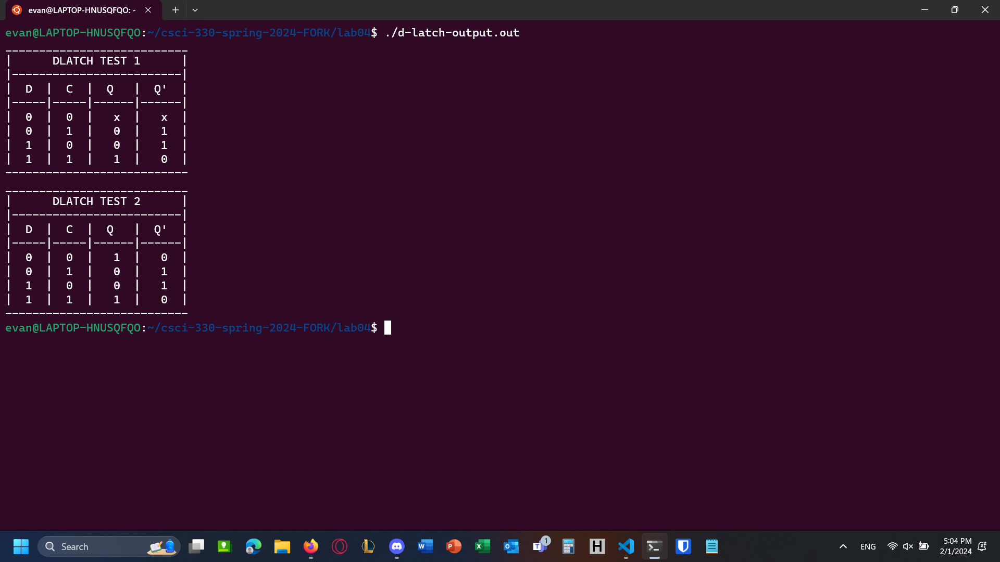

[Back to Portfolio](./)

D Latch
===============

-   **Class:** CSCI 330
-   **Grade:** 100
-   **Language(s):** iVerilog
-   **Source Code Repository:** [echill76/project4](https://github.com/echill76/project4)
    (Please [email me](mailto:echill@csustudent.net?subject=GitHub%20Access) to request access.)

## Project description

This project is a re-creation of a D Latch circuit made using the iVerilog HDL (Hardware Definition Language)

## How to compile and run the program
Make sure you are in the same directory as the source code files.

```bash
D Latch Compile Command: iverilog d-latch*.v -o d-latch-output.out
D Latch Run Command: ./d-latch-output.out
```
## UI Design
The test program is designed to be easy to read while still providing all the necessary information.

  
Fig. 1: Test program running

[Back to Portfolio](./)
